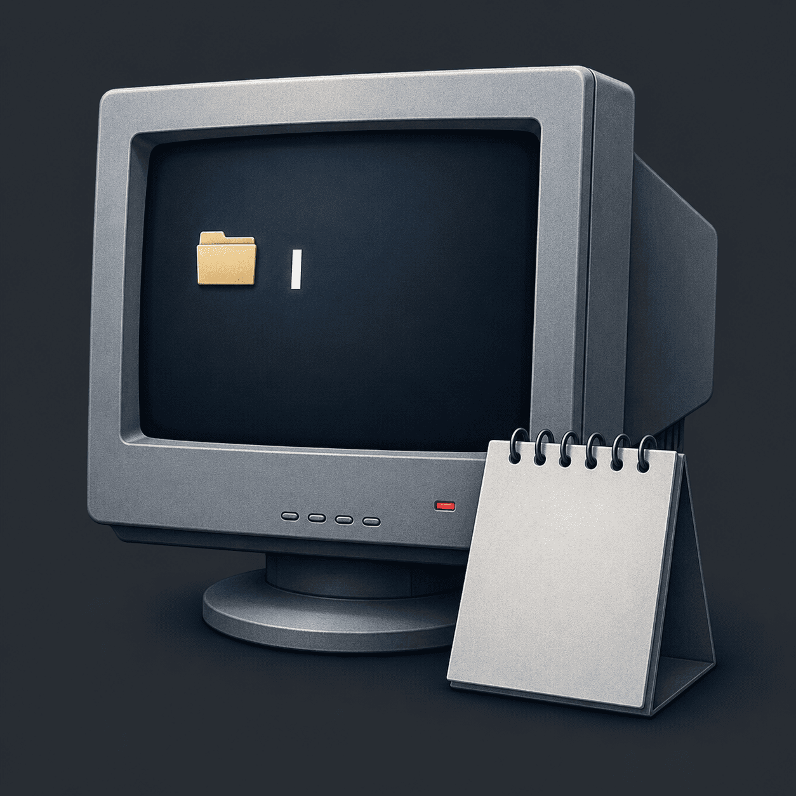

# До пятницы

<p align="center">
  
</p>

<h1 align="center">До пятницы</h1>

<p align="center">
  <strong>Психологическая офисная игра о пяти рабочих днях, слухах, подозрениях и решении, которое ждёт тебя в пятницу.</strong>
</p>

<p align="center">
  
  
  
  
</p>

---

## 🎮 Об игре

Ты возвращаешься в офис после отпуска и обнаруживаешь, что обычная рабочая неделя больше не кажется обычной.

Перед отпуском ты случайно услышал разговор директора и кадровика. В пятницу кому-то собираются объявить важное решение. Имя ты не услышал.

Теперь у тебя есть пять рабочих дней.

Можно просто выполнять задачи и дождаться пятницы.

Можно разговаривать с коллегами, искать документы, проверять почту, копаться в файловой системе, собирать улики, пользоваться Терминалом, нарушать правила компании — или наоборот, держаться от всего этого подальше.

**Игра не говорит тебе, кому верить. Она запоминает, что сделал ты.**

---

## 🖥️ Как это играется

Игра притворяется рабочим компьютером обычного офисного сотрудника.

Твой рабочий стол — не просто меню, а игровое пространство:

- 📁 **Проводник** — документы, фотографии, папки и скрытая информация;
- ✉️ **Почта** — рабочие поручения, письма и вложения;
- 💬 **МИН** — переписка с коллегами и живые сюжетные разговоры;
- ✅ **Задачи** — настоящая офисная рутина, которую можно честно выполнять;
- 💻 **Терминал** — команды, часть которых может изменить ход событий;
- 📋 **Журнал** — следы твоих действий и найденных событий;
- 🗑️ **Корзина** — удалённые документы и последствия попыток что-то скрыть.

Окна можно перемещать, сворачивать и использовать как настоящий рабочий стол.

---

## 🕐 Пять дней до пятницы

### Понедельник

Возвращение в офис. Первые задачи. Первые разговоры. Первые слухи.

Ты ещё можешь убедить себя, что ничего серьёзного не происходит.

### Вторник

Становится понятно, что странностей больше, чем казалось.

Бухгалтерия, доступы, документы и разговоры коллег начинают складываться в одну неприятную картину.

### Среда

В игру входит служба безопасности.

Теперь некоторые действия уже невозможно просто забыть. Проверки оставляют следы, а попытки что-то скрыть могут оказаться заметнее самой ошибки.

### Четверг

Последний день перед встречей.

Начальник напоминает о пятничном разговоре с директором и кадрами. Коллеги начинают понимать, что ты что-то готовишь.

Ты уже не просто наблюдаешь за происходящим — ты становишься его частью.

### Пятница

В 17:00 состоится встреча.

К этому моменту игра уже знает, что ты делал всю неделю.

---

## 🧩 Что можно делать

**Работать нормально**

Выполнять поручения, разбирать почту, исправлять таблицы и не лезть туда, куда не просили.

**Искать правду**

Сопоставлять письма, документы, разговоры и действия сотрудников.

**Собирать компромат**

Копировать материалы, архивировать документы, использовать найденные сведения против коллег.

**Нарушать правила**

Терминал и доступ к файловой системе открывают возможности, которых обычному сотруднику иметь не положено.

**Играть в долгую**

Не обязательно выбирать сторону сразу. Иногда гораздо важнее то, что ты решил не делать.

---

## 💬 Люди здесь всё помнят

Коллеги не являются просто кнопками для получения квестов.

Дима может заметить, что ты изменился.

Олег может принести слух, который лучше было не знать.

Марина может заметить странность в бухгалтерских документах.

Роман следит за доступами и видит операции с файлами.

Виктор из службы безопасности задаёт вопросы, на которые не всегда стоит отвечать одинаково.

Андрей, твой начальник, смотрит не только на результат работы, но и на то, **как ты провёл эту неделю**.

МИН постепенно превращается из обычного мессенджера в одну из главных частей истории.

---

## 🔎 Никаких полосок «морали»

Ты не увидишь:

`Подозрение: 73%`

`Репутация: -2`

`Доверие начальника: 41`

Вместо этого игра показывает последствия через мир.

Кто-то начинает отвечать суше.

Кто-то перестаёт давать доступ.

Кто-то вспоминает твою вчерашнюю ложь.

В письме появляется лишняя формальность.

Человек, которому ты вчера подставил другого сотрудника, сегодня может задать совершенно другой вопрос.

**Ты сам должен понять, что изменилось.**

---

## 🎭 Улики не дают одного правильного ответа

Найденный документ может означать несколько вещей.

Странное письмо может быть случайностью.

Подозрительная операция может оказаться обычной рабочей процедурой.

Человек может лгать тебе — а может просто не знать всей картины.

Игра специально избегает кнопки **«Вот правильная версия происходящего»**.

---

## 🏁 Десять базовых концовок

Неделя заканчивается в пятницу, но финал определяется не одним последним выбором.

Учитываются решения, принятые в течение всей недели: честность, работа, отношения с коллегами, найденные материалы, использование Терминала, попытки что-то скрыть и готовность взять ответственность.

Одна и та же пятничная встреча может привести к совершенно разным результатам.

---

## 🛠️ Техническая сторона

Проект работает прямо в браузере и не требует сборки.

Основные технологии:

- HTML;
- CSS;
- JavaScript;
- `localStorage` для сохранений;
- Canvas для программной нарезки спрайт-листов;
- собственный игровой движок и событийная система.

### Запуск

```bash
python -m http.server 8080
```

После этого открыть:

```text
http://localhost:8080
```

Прямое открытие `index.html` может работать, но локальный сервер предпочтительнее из-за загрузки изображений и Canvas.

---

## 🗂️ Структура проекта

```text
index.html                     каркас игры
styles.css                     базовый интерфейс рабочего стола
styles-v2.css                  интерфейс пятидневной версии
onboarding.css                 меню, пролог и вход
work-minigames.css             рабочие мини-задачи
asset-ui.css                   оформление ассетов
workflow.css                   документооборот между приложениями
src/engine.js                  игровой движок
src/story-v2.js                основной сюжет
src/app-v2.js                  приложения и интерфейс
src/onboarding.js              меню, пролог и ввод имени
src/work-minigames.js          рабочие мини-задачи
src/workflow-extension.js      работа с файлами и сохранениями
src/asset-registry.js          реестр изображений
src/sprite-atlas.js            программная нарезка спрайт-листов
src/asset-ui.js                использование ассетов
assets/                        визуальные материалы игры
```

---

## 🧪 Проверки

```bash
node tests/engine.test.js
node tests/story-validation.test.js
node tests/rules-extension.test.js
node tests/ui-contract.test.js
```

Проверки также подключены к GitHub Actions.

---

## 📌 Принципы

- никаких видимых шкал морали, подозрения или репутации;
- любая улика допускает несколько трактовок;
- честная работа — полноценная часть геймплея;
- нарушения и команды Терминала полностью вымышлены;
- интерфейс должен ощущаться настоящим офисным компьютером;
- последствия проявляются через персонажей и мир;
- финал зависит от всей недели, а не только от последнего выбора.

---

<p align="center">
  
  <br>
  <strong>До пятницы</strong>
  <br>
  <sub>Пять рабочих дней. Один разговор. Слишком много способов всё испортить.</sub>
</p>
